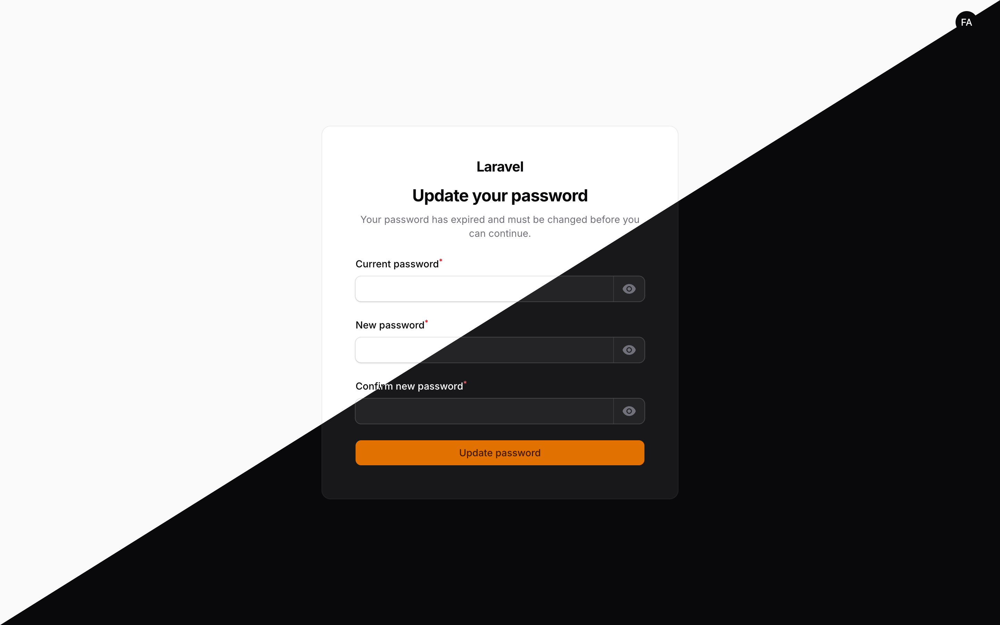
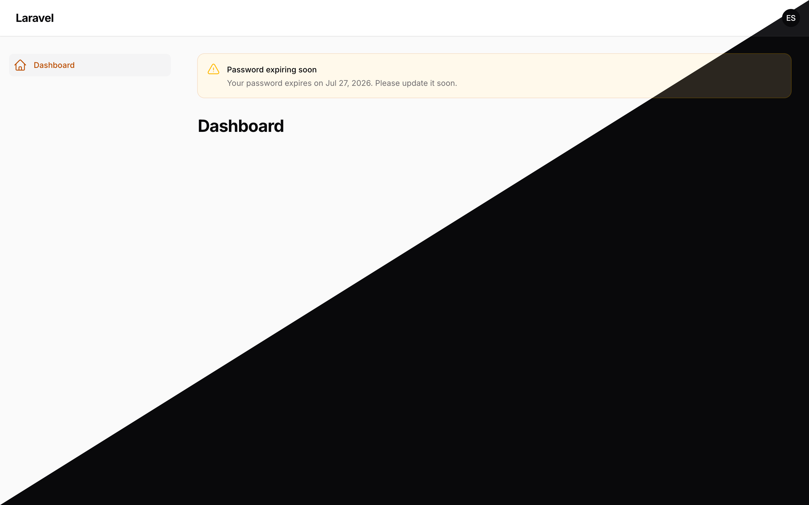
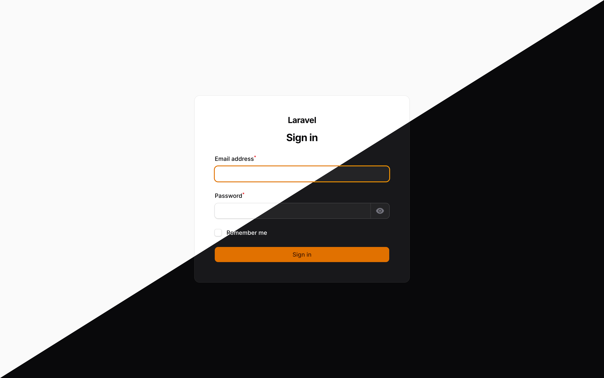

# Filament Password Rotation

[](https://packagist.org/packages/bbs-lab/filament-password-rotation)
[](https://github.com/BBS-Lab/filament-password-rotation/actions)
[](https://packagist.org/packages/bbs-lab/filament-password-rotation)

Force any authenticatable model to **rotate its password every N days**. When the password expires, a
[Filament](https://filamentphp.com) panel middleware redirects the logged-in user to a native, full-page
Filament change-password screen. Light, secure, and enabled with a single `->plugin()` line.

The rotatable subject is **not** tied to the `User` model: everything keys off the
`MustRotatePassword` interface on whatever user the panel authenticated, and the password history is
**polymorphic**, so any model works.

## Screenshots

> Each screenshot is split diagonally: **light theme** (top-left) / **dark theme** (bottom-right).

**Forced password-change screen** — shown when a password has expired:



**Expiry warning** — a callout at the top of every panel page while the password nears expiry:



**Sign-in screen**



## Features

- 🔒 Forces a password change once the current one is older than `days`
- 🧭 Filament panel middleware redirect to a **native** full-page Livewire change screen
- 🧬 **Interface-gated**: only enforced when the authenticated user implements `MustRotatePassword`
- 🗂️ **Polymorphic** password history — any authenticatable model is supported
- 🚫 **Reuse prevention**: rejects the last N hashed passwords, and forbids reusing the current one
- 👋 **First-login enforcement**: admin-provisioned accounts must set their own password
- ⏰ **Expiry warning**: a Filament callout banner at the top of every panel page while the password is within the warning window
- 📊 `password-rotation:report` Artisan command to audit account status
- 📣 A `PasswordRotated` event you can listen to
- 🌍 English & French translations, publishable
- 🧪 100% line coverage, PHPStan level 8, no `final` classes, strict types everywhere

## Requirements

- PHP `^8.2`
- Filament `^4.0 || ^5.0`
- Laravel `^11.0 || ^12.0 || ^13.0`

## Installation

```bash
composer require bbs-lab/filament-password-rotation
```

The service provider auto-registers via Laravel package discovery. The `password_histories` migration
runs automatically. Publish the config and translations if you want to tweak them:

```bash
# Filament-specific config (slug, expiry_action)
php artisan vendor:publish --tag=filament-password-rotation-config

# Base rotation config (days, history_count, warn_days, …)
php artisan vendor:publish --tag=laravel-password-rotation-config

# Translations (en, fr)
php artisan vendor:publish --tag=filament-password-rotation-translations

# The users-table migration stub (adds the rotation column) — edit it per table before migrating
php artisan vendor:publish --tag=laravel-password-rotation-user-migration

php artisan migrate
```

The published users migration adds the nullable rotation column (`password_changed_at` by default)
and **backfills existing rows to `now()`** so no one is locked out on deploy. Edit the stub to target
the correct table if your rotatable model is not `users`.

### Enable the plugin

Register the plugin on the panel you want to protect, in your `PanelProvider`:

```php
use BBSLab\FilamentPasswordRotation\FilamentPasswordRotationPlugin;
use Filament\Panel;

public function panel(Panel $panel): Panel
{
    return $panel
        // ...
        ->plugin(FilamentPasswordRotationPlugin::make());
}
```

That one line appends the `EnsurePasswordIsNotExpired` middleware to the panel's authenticated stack
and registers the forced-change page route. There is no zero-config auto-registration: Filament has no
clean hook to inject a page route into every panel, so registration is always explicit.

## Quick start

Add the interface and trait to the authenticatable model you want to rotate:

```php
use BBSLab\LaravelPasswordRotation\Concerns\RotatesPassword;
use BBSLab\LaravelPasswordRotation\Contracts\MustRotatePassword;
use Illuminate\Foundation\Auth\User as Authenticatable;

class User extends Authenticatable implements MustRotatePassword
{
    use RotatesPassword;
}
```

The trait implements the whole interface, casts the rotation column to a `datetime`, stamps it on
every password change, records history, and fires `PasswordRotated`. On create it stamps the column
too — unless `force_on_first_login` is on (the default), in which case the column is left `null` so
the account is forced to set its own password on first login. Run the published migration and you are
done — expired users are redirected on their next full page load in the panel.

## Configuration

The generic rotation keys live in the base package's `config/laravel-password-rotation.php`; the
Filament-specific keys (`slug`, `expiry_action`) live in `config/filament-password-rotation.php`. All
are driven by an environment variable.

| Config key                 | Env var                              | Default                | Description                                                                                                    |
| -------------------------- | ------------------------------------ | ---------------------- | -------------------------------------------------------------------------------------------------------------- |
| `enabled`                  | `PASSWORD_ROTATION_ENABLED`          | `true`                 | Master switch. When `false` the package is inert: no forced change, no warnings.                               |
| `morph_key_type`           | `PASSWORD_ROTATION_MORPH_KEY_TYPE`   | `null`                 | Key type for the password-history `authenticatable_id` column. Set to `uuid`/`ulid` for string-keyed users; `null` follows Laravel's default.|
| `days`                     | `PASSWORD_ROTATION_DAYS`             | `90`                   | How many days a password stays valid, counted from the rotation column.                                        |
| `column`                   | `PASSWORD_ROTATION_COLUMN`           | `password_changed_at`  | The timestamp column storing when the password last changed. Override per model via `passwordRotationColumn()`.|
| `force_on_first_login`     | `PASSWORD_ROTATION_FORCE_FIRST_LOGIN`| `true`                 | Treat a `null` timestamp as expired, so provisioned accounts must set their own password.                      |
| `require_current_password` | `PASSWORD_ROTATION_REQUIRE_CURRENT`  | `true`                 | Require confirmation of the current password on the change screen.                                             |
| `history_count`            | `PASSWORD_ROTATION_HISTORY_COUNT`    | `3`                    | Number of previous (hashed) passwords remembered and rejected. `0` disables history entirely.                  |
| `warn_days`                | `PASSWORD_ROTATION_WARN_DAYS`        | `7`                    | Show a Filament notice this many days before expiry. `0` disables the warning.                                 |
| `slug`                     | `PASSWORD_ROTATION_SLUG`             | `password/rotate`      | The change screen lives at `{panel}/{slug}`. A `/` becomes a `.` in the route name. Change only on a collision.|
| `expiry_action`            | `PASSWORD_ROTATION_EXPIRY_ACTION`    | `change`               | `change` shows the in-panel change form; `reset` shows a button that emails a reset link and signs the user out. `reset` requires the model to implement `CanResetPassword`.|
| `models`                   | —                                    | `['App\Models\User']`  | Models scanned by `password-rotation:report`. The middleware does **not** use this list.                       |

> The `slug` must be set before the panel registers its routes — via the published config file, an
> `.env` var, or `config:cache` — never with a runtime `config()->set()` after boot: the route is
> compiled once at boot and its name is pinned then.

> The `models` array only feeds the report command. The middleware works off the interface on the
> authenticated user, so any model is enforced regardless of this list.

## Usage

### The forced-change flow

On every full panel page load, `EnsurePasswordIsNotExpired` checks the authenticated user. If it
implements `MustRotatePassword` and its password has expired, the user is redirected to the
forced-change page — a full-page Filament Livewire component rendered with the login-style simple
layout, so it looks native without any extra build step. The page route and the panel logout route
are skipped so the redirect never loops. On a successful update the user is sent back to the panel
dashboard with a success Filament notification.

### Reuse prevention

When `history_count > 0`, every password change is hashed and stored in the polymorphic
`password_histories` table (only the newest N rows are kept per user). The change screen rejects any of
those previous passwords, and always rejects reusing the current one. You can reuse the rule directly:

```php
use BBSLab\LaravelPasswordRotation\Rules\PasswordNotReused;

$request->validate([
    'password' => ['required', 'confirmed', new PasswordNotReused($user)],
]);
```

### First login

With `force_on_first_login` enabled (the default), a `null` rotation column counts as expired.
Admin-provisioned accounts are therefore forced to set their own password before using the panel. The
published migration backfills existing rows so current users are not caught out.

### Expiry warning

When `warn_days > 0`, a still-valid user whose password is within the warning window sees a Filament
warning callout at the top of every panel page, injected via the `PAGE_START` render hook. It renders
on each page load while inside the window and stays inert otherwise.

### The `password-rotation:report` command

Audit the accounts declared in `config('laravel-password-rotation.models')`:

```bash
# Only accounts that are expired or expiring within warn_days
php artisan password-rotation:report

# Every account
php artisan password-rotation:report --all
```

It renders a table of identifier, last-changed, expires-at and status (`expired` / `expiring soon` /
`ok`). Classes that do not exist or do not implement `MustRotatePassword` are skipped.

### The `PasswordRotated` event

Dispatched after a password change is persisted (not on the initial create). Listen for it to log,
notify, or revoke sessions:

```php
use BBSLab\LaravelPasswordRotation\Events\PasswordRotated;
use Illuminate\Support\Facades\Event;

Event::listen(function (PasswordRotated $event) {
    logger()->info('Password rotated', ['user' => $event->authenticatable->getKey()]);
});
```

## Testing

```bash
composer test            # Pest suite
composer test-coverage   # 100% line coverage on src/
composer analyse         # PHPStan level 8
composer format          # Pint (laravel preset + strict types)
```

A full embedded Filament app (via [Orchestra Workbench](https://github.com/orchestral/workbench)) lets
you exercise the flow in a real panel:

```bash
composer serve   # boots the admin panel at http://localhost:8000/admin
```

## Security

Passwords are stored only as hashes — the history table keeps a **copy of the already-hashed** value,
never plaintext. Reuse checks run through `Hash::check`. `Hash::make` is idempotent against a hashed
cast, so passwords stay single-hashed. If you discover a security issue, please email
`paris@big-boss-studio.com` instead of using the issue tracker.

## Nova

Using [Laravel Nova](https://nova.laravel.com) instead of Filament? Its twin,
[`bbs-lab/nova-password-rotation`](https://github.com/BBS-Lab/nova-password-rotation), brings the same
password rotation to Nova.

## Changelog

Please see [CHANGELOG](CHANGELOG.md) for what has changed recently.

## Contributing

Please see [CONTRIBUTING](.github/CONTRIBUTING.md) for details.

## Credits

- [Big Boss Studio](https://github.com/BBS-Lab)

## License

The MIT License (MIT). Please see [License File](LICENSE.md) for more information.
